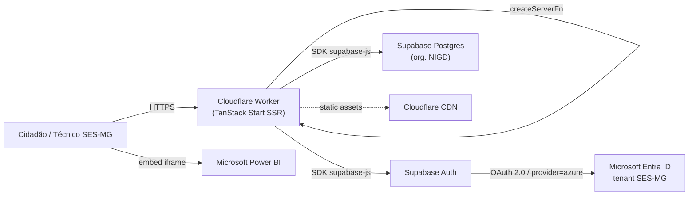
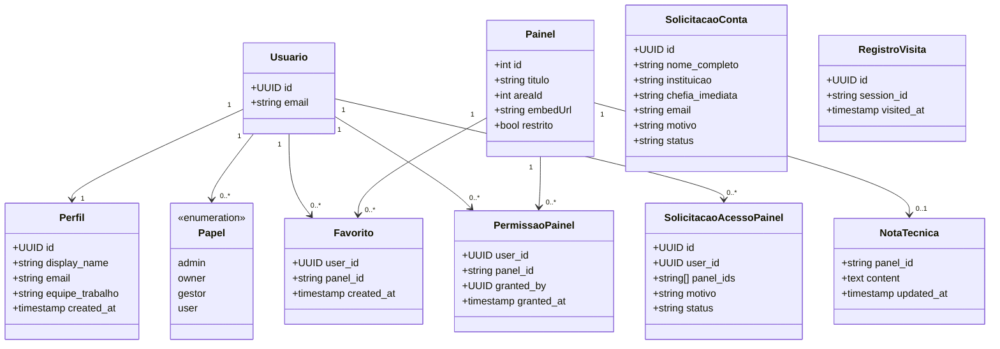
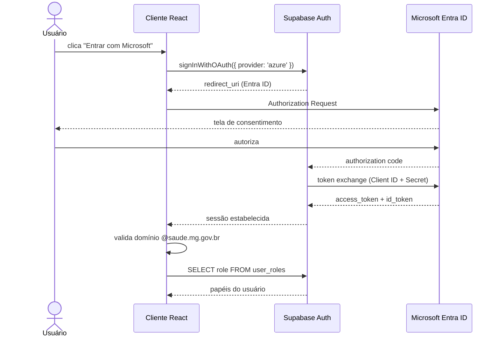
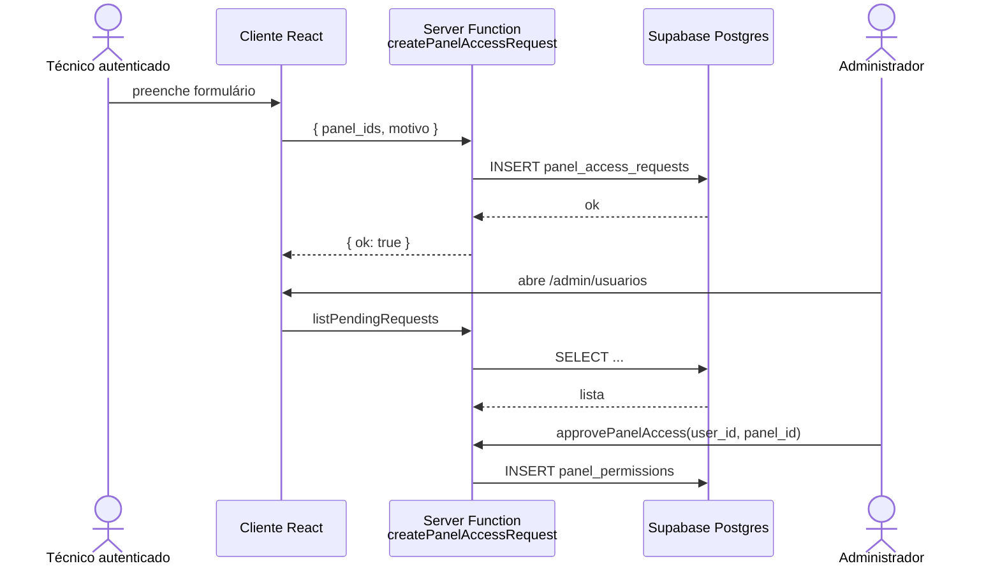
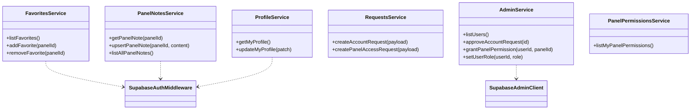
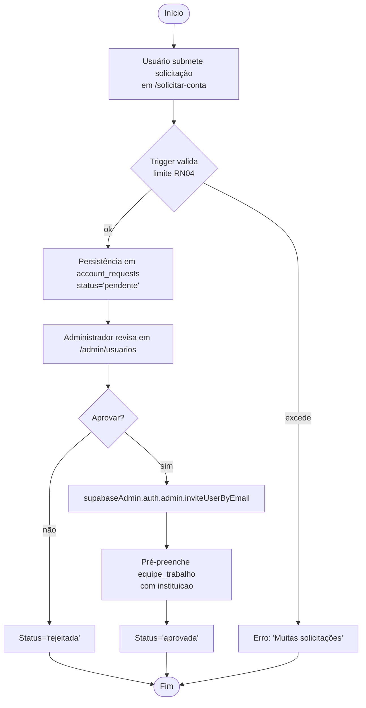
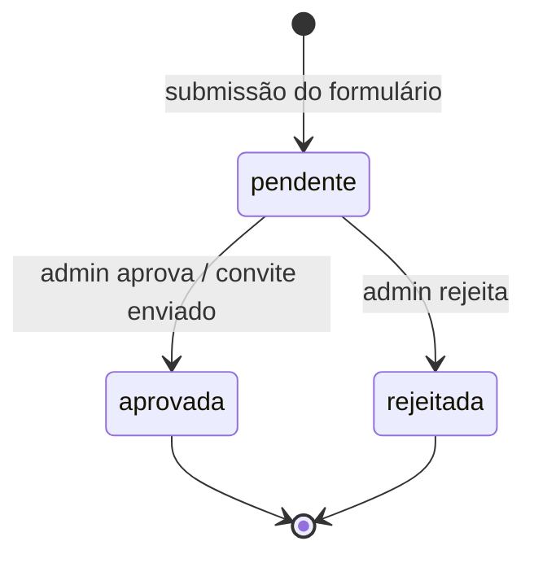
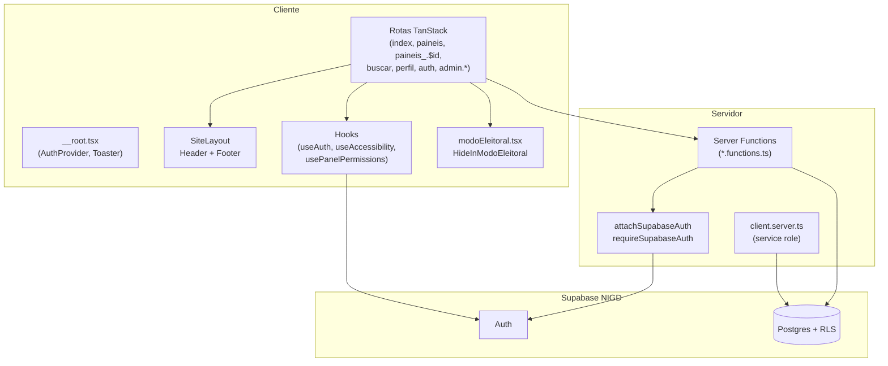
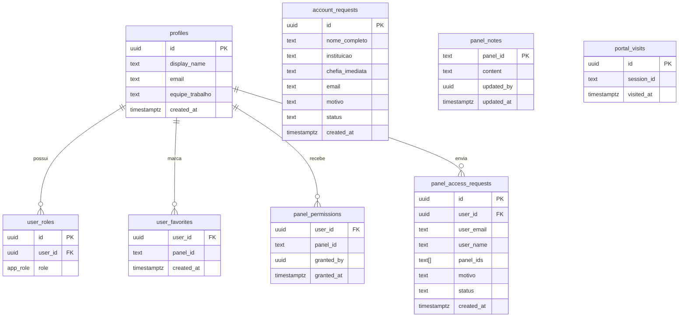
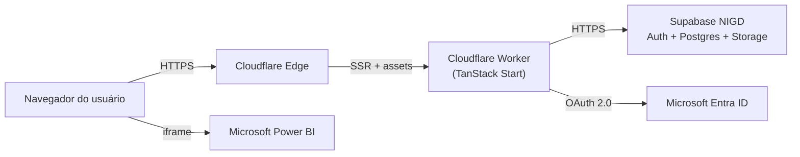

% Portal InfoSaúde MG — Documentação Técnica do Produto de Software
% Trabalho de Graduação
% 2026

---

# Prefácio

Este documento apresenta a documentação técnica do portal **InfoSaúde MG**, plataforma web de divulgação de painéis e indicadores em saúde pública desenvolvida para a Secretaria de Estado de Saúde de Minas Gerais (SES-MG). A estrutura segue o roteiro definido em *Documentação de um Produto de Software — Versão 3.0* (USJT), com adaptação dos artefatos UML às tecnologias adotadas no projeto: TanStack Start (React 19 sobre Vite 7), Tailwind CSS v4, runtime serverless Cloudflare Workers e backend Supabase. O texto cobre a totalidade do ciclo de desenvolvimento, da concepção à implantação, incluindo três marcos relevantes na evolução do produto: (i) a evolução incremental das funcionalidades, (ii) a migração arquitetural do backend nativo *Lovable Cloud* para uma instância externa do Supabase pertencente à organização **NIGD**, motivada por restrições corporativas à integração SSO SAML, e (iii) a implementação da variável `VITE_MODO_ELEITORAL`, que assegura conformidade com a legislação eleitoral brasileira.

Os termos sinalizados pela marca ^G^ encontram-se descritos no Glossário.

---

# 1. Introdução ao Documento

## 1.1. Tema

O presente trabalho tem como tema o **desenvolvimento de um portal web institucional para a divulgação centralizada de painéis analíticos em saúde pública** no âmbito da Secretaria de Estado de Saúde de Minas Gerais, com suporte a autenticação corporativa, gestão diferenciada de painéis públicos e restritos, controle administrativo de usuários e conformidade com requisitos jurídicos do calendário eleitoral.

## 1.2. Objetivo do Projeto

### Objetivo geral

Projetar e implementar uma plataforma digital responsiva que unifique o acesso aos painéis de Business Intelligence (Power BI) produzidos pelas diretorias técnicas da SES-MG, oferecendo navegação por áreas temáticas, mecanismos de busca, controle de acesso a painéis sensíveis, marcadores de uso e área administrativa para gestão de conteúdo.

### Objetivos específicos

a) Catalogar e expor de forma navegável os painéis existentes em dez áreas temáticas distintas;
b) Implementar autenticação institucional via *Single Sign-On* (SSO) com Microsoft Entra ID, restrita ao domínio `@saude.mg.gov.br`, com login alternativo por e-mail e senha para casos excepcionais;
c) Prover fluxo formal de solicitação de conta e de acesso a painéis restritos, com aprovação por administradores;
d) Disponibilizar área administrativa para gestão de usuários, papéis, notas técnicas associadas a painéis e visualização de estatísticas de visitação;
e) Garantir acessibilidade (controle de tamanho de fonte, contraste e *VLibras*) e otimização para dispositivos móveis;
f) Assegurar conformidade jurídica com a Lei nº 9.504/1997 (Lei das Eleições) por meio de um modo de operação restrito acionável por variável de ambiente.

## 1.3. Delimitação do Problema

A SES-MG produz dezenas de painéis analíticos em Power BI, distribuídos historicamente em sítios departamentais distintos e sem padrão visual ou de governança unificado. O escopo deste projeto compreende a construção do portal de **descoberta, navegação e acesso** a esses painéis (que continuam hospedados no serviço Power BI por meio de *embeds*), bem como toda a camada de **autenticação, autorização, controle administrativo e auditoria de uso**. Estão **fora do escopo** a produção dos painéis em si, a ingestão dos dados de origem, a integração com o *Data Warehouse* corporativo e a operação do tenant Microsoft 365 do Estado.

## 1.4. Justificativa da Escolha do Tema

A pulverização dos painéis em endereços distintos dificultava sua localização por gestores, técnicos e cidadãos, fragmentava a identidade visual institucional e impossibilitava o controle centralizado de quem acessava conteúdo sensível. Um portal único, com classificação por área temática, busca textual e governança de acesso, atende simultaneamente a três demandas: (i) **transparência ativa** ao cidadão; (ii) **eficiência operacional** para os técnicos da SES-MG; e (iii) **conformidade** com normas de segurança da informação e legislação eleitoral. Academicamente, o projeto oferece um caso completo de aplicação de engenharia de software em ambiente real, contemplando arquitetura *full-stack*, segurança baseada em papéis, integração com provedor de identidade corporativo e migração arquitetural motivada por restrições não funcionais.

## 1.5. Método de Trabalho

Adotou-se um processo **iterativo e incremental** de inspiração ágil, com entregas curtas validadas continuamente pela equipe da SES-MG. A modelagem é **orientada a objetos**, com notação UML para os diagramas, e as escolhas tecnológicas privilegiam tipagem estática (TypeScript estrito) e separação clara entre código de cliente, código de servidor e camada de persistência. O versionamento do código segue *trunk-based development*; as alterações de banco de dados são propagadas por migrações declarativas (`supabase/migrations`). A documentação técnica é mantida em formato Markdown versionado no próprio repositório, garantindo rastreabilidade entre artefatos e código.

## 1.6. Organização do Trabalho

O documento está organizado em nove capítulos. O Capítulo 2 descreve o problema, os envolvidos e as regras de negócio. O Capítulo 3 detalha os requisitos funcionais, não funcionais, protótipo e métricas. O Capítulo 4 trata da análise e *design*, incluindo arquitetura, modelo de domínio, diagramas de interação, classes, atividades, estados, componentes, modelo de dados e ambiente de desenvolvimento. O Capítulo 5 descreve a implementação, com ênfase na pilha React/Vite, no backend Supabase e na lógica do Modo Eleitoral. O Capítulo 6 apresenta o plano e a execução dos testes. O Capítulo 7 cobre a implantação. O Capítulo 8 funciona como manual do usuário. O Capítulo 9 traz as conclusões e considerações finais. Encerram o documento a bibliografia e o glossário.

## 1.7. Glossário

Vide capítulo final. Termos marcados com ^G^ no corpo do texto possuem entrada no glossário.

---

# 2. Descrição Geral do Sistema

## 2.1. Descrição do Problema

A SES-MG, responsável pela coordenação do Sistema Único de Saúde em Minas Gerais, produz continuamente painéis analíticos em Microsoft Power BI cobrindo dez áreas temáticas: Vigilância Epidemiológica, Estudos Técnicos, Gestão, Regulação do Acesso a Serviços de Saúde, Atenção Primária, Regionalização, Vigilância Sanitária, Auditoria do SUS-MG, Saúde Digital e Atenção Especializada. Esses painéis encontravam-se dispersos em URLs departamentais, sem inventário consolidado, sem ponto único de entrada e sem mecanismo de controle de acesso aos painéis classificados como restritos. Como consequência:

- O cidadão e o gestor municipal tinham dificuldade em localizar dados relevantes;
- Não havia segregação técnica entre conteúdo aberto e conteúdo de uso interno;
- A identidade visual institucional variava entre páginas;
- Não havia registro sistemático de visitação para subsidiar a evolução do catálogo;
- Em períodos eleitorais, a remoção pontual de menções a autoridades exigia intervenção manual em cada página, gerando risco de inconformidade com o art. 73 da Lei nº 9.504/1997.

O portal InfoSaúde MG endereça esses pontos provendo um inventário único, navegação padronizada, autenticação e autorização institucionais, área administrativa e mecanismos automáticos de conformidade.

## 2.2. Principais Envolvidos e suas Características

| Envolvido | Caracterização | Interesse no sistema |
| --- | --- | --- |
| Cidadão | Visitante anônimo, dispositivos heterogêneos (predominância móvel) | Consultar indicadores e painéis públicos |
| Técnico SES-MG | Servidor com conta corporativa `@saude.mg.gov.br` | Acessar painéis restritos da sua área de trabalho |
| Gestor municipal | Vinculado a Secretaria Municipal de Saúde | Acompanhar indicadores regionais e nacionais |
| Administrador (`admin`) | Servidor designado pela SES-MG | Gerenciar usuários, permissões, notas técnicas e solicitações |
| *Owner* | Perfil técnico de mais alto privilégio | Operações administrativas críticas e auditoria global |
| Gestor de conteúdo (`gestor`) | Papel intermediário | Manutenção do catálogo de painéis e notas |
| Patrocinador (SES-MG) | Diretoria responsável pelo projeto | Conformidade jurídica, governança e visibilidade institucional |

## 2.3. Regras de Negócio ^G^

**RN01.** O acesso autenticado é restrito a contas do domínio institucional `@saude.mg.gov.br` quando o provedor utilizado for o Microsoft Entra ID. A validação ocorre tanto na função `handle_new_user` do banco de dados (negando inserção com `SQLSTATE 42501`) quanto no *hook* de autenticação do cliente.

**RN02.** Todo usuário recém-criado recebe automaticamente o papel `user`. Os papéis `admin`, `owner` e `gestor` são atribuídos exclusivamente pela área administrativa, persistidos na tabela `user_roles` e verificados pela função `has_role(_user_id, _role)`.

**RN03.** Painéis classificados como `restrito = true` em `src/data/site.ts` somente são exibidos para usuários com permissão explícita registrada em `panel_permissions` ou para usuários com papel `admin`/`owner`.

**RN04.** A solicitação de conta institucional (`account_requests`) é limitada a **cinco registros por endereço de e-mail em janela móvel de 24 horas**, regra aplicada pela trigger `validate_account_request`.

**RN05.** Os registros de visitação (`portal_visits`) são limitados a **duzentos eventos por sessão em janela de uma hora**, regra aplicada pela trigger `validate_portal_visit`, evitando inflação de métricas e abuso.

**RN06.** A alteração de senha exige a confirmação da senha atual **e** a inserção de um código OTP de seis dígitos enviado por e-mail, com validade de cinco minutos.

**RN07.** Quando a variável `VITE_MODO_ELEITORAL` estiver definida como `"true"`, elementos institucionais vedados pela legislação eleitoral (nomes e fotos de autoridades, ficha técnica, slogans, logos da gestão) devem ser ocultados do *layout*, preservando a integridade dos painéis técnicos.

**RN08.** A nota técnica associada a um painel (`panel_notes`) é leitura permitida apenas a usuários autenticados; sua edição é restrita ao perfil `admin`.

**RN09.** Solicitações de acesso a painéis restritos (`panel_access_requests`) são submetidas por usuários autenticados, contendo a lista de IDs de painéis e justificativa, e devem ser aprovadas individualmente pela administração.

**RN10.** O campo `equipe_trabalho` do perfil é pré-preenchido a partir da `instituicao` declarada na solicitação de conta, no momento em que a conta é aprovada via `auth.admin.inviteUserByEmail`.

---

# 3. Requisitos do Sistema

## 3.1. Requisitos Funcionais

Os requisitos funcionais foram derivados das *server functions* declaradas em `src/lib/*.functions.ts` e dos componentes de rota em `src/routes/`. Cada requisito é apresentado em formato resumido de caso de uso.

| Código | Caso de uso | Atores | Pré-condição |
| --- | --- | --- | --- |
| RF01 | Navegar pelo catálogo de painéis por área temática | Cidadão, Técnico | — |
| RF02 | Buscar painéis por termo, com normalização de acentos | Cidadão, Técnico | — |
| RF03 | Visualizar painel Power BI incorporado em página dedicada | Cidadão, Técnico | Painel público OU permissão concedida |
| RF04 | Autenticar via Microsoft Entra ID (OAuth 2.0, *provider* `azure`) | Técnico | Conta `@saude.mg.gov.br` |
| RF05 | Autenticar via e-mail/senha | Técnico | Conta provisionada por administrador |
| RF06 | Recuperar/redefinir senha por código OTP | Técnico | Conta existente |
| RF07 | Solicitar criação de conta institucional | Técnico externo | Limite RN04 |
| RF08 | Solicitar acesso a painéis restritos | Técnico autenticado | Sessão válida |
| RF09 | Marcar painel como favorito | Técnico autenticado | Sessão válida |
| RF10 | Editar nota técnica de painel (*panel notes*) | Administrador | Papel `admin` |
| RF11 | Gerenciar usuários: aprovar conta, atribuir papéis, conceder/revogar permissão de painel | Administrador | Papel `admin`/`owner` |
| RF12 | Consultar estatísticas de visitação (mês atual, mês anterior, mês específico) | Administrador | Papel `admin`/`owner` |
| RF13 | Editar perfil próprio (nome de exibição, equipe de trabalho) | Técnico autenticado | Sessão válida |
| RF14 | Acessar menu de acessibilidade (tamanho de fonte, contraste, VLibras) | Qualquer | — |
| RF15 | Operar o portal em **Modo Eleitoral**, ocultando elementos institucionais vedados | Sistema | `VITE_MODO_ELEITORAL = "true"` |

### Caso de uso detalhado — RF04 (Login via Microsoft)

- **Ator principal:** Técnico SES-MG
- **Pré-condições:** Conta `@saude.mg.gov.br` ativa no Microsoft Entra ID; Client ID e Secret configurados no projeto Supabase NIGD.
- **Fluxo principal:**
  1. Usuário acessa `/auth` e seleciona "Entrar com Microsoft";
  2. Cliente invoca `supabase.auth.signInWithOAuth({ provider: 'azure' })`;
  3. Supabase redireciona ao endpoint OAuth 2.0 do Entra ID;
  4. Usuário consente; Entra ID retorna *authorization code*;
  5. Supabase troca o código por *access token* e cria a sessão;
  6. Cliente, no *listener* `onAuthStateChange`, valida que o e-mail termina em `@saude.mg.gov.br`;
  7. Em caso afirmativo, persiste a sessão e busca os papéis do usuário em `user_roles`.
- **Fluxo de exceção:** caso o domínio não corresponda, executa-se `supabase.auth.signOut()` e exibe-se *toast* informativo.

## 3.2. Requisitos Não-Funcionais

| Código | Categoria | Requisito |
| --- | --- | --- |
| RNF01 | Desempenho | Tempo de resposta inferior a 2 s na *home* em rede 4G urbana |
| RNF02 | Disponibilidade | Hospedagem em *edge runtime* (Cloudflare Workers), com SLA herdado do provedor |
| RNF03 | Segurança | RLS ^G^ habilitada em toda tabela de dados de usuário; *service role key* nunca exposta ao navegador |
| RNF04 | Segurança | Login institucional restrito ao domínio `@saude.mg.gov.br` |
| RNF05 | Acessibilidade | Conformidade com WCAG 2.1 nível AA nos componentes do *design system*; integração com VLibras |
| RNF06 | Responsividade | Suporte pleno a *viewports* de 320 px a 1920 px |
| RNF07 | Internacionalização | Interface em Português (Brasil); preparada para expansão futura |
| RNF08 | Manutenibilidade | TypeScript estrito (`strict: true`); ESLint + Prettier; componentes funcionais |
| RNF09 | Observabilidade | Registro de visitação (`portal_visits`) com agregações via funções *security definer* |
| RNF10 | Conformidade jurídica | Modo Eleitoral acionável por variável de ambiente, sem necessidade de remoção de código |
| RNF11 | Privacidade | E-mails em *lower-case*; mensagens de erro genéricas em fluxos de autenticação |

## 3.3. Protótipo

A interface foi prototipada utilizando o ecossistema **shadcn/ui** sobre **Tailwind CSS v4**, com paleta institucional inspirada nos elementos visuais do Governo de Minas Gerais. O protótipo executável **é o próprio código-fonte**, hospedado em ambiente de pré-visualização, o que reduz a divergência entre artefato de *design* e produto final. As telas principais — *home*, listagem de painéis, página de painel, perfil, autenticação, área administrativa — foram validadas com a equipe técnica da SES-MG ao longo de iterações sucessivas.

## 3.4. Métricas e Cronograma

O projeto foi conduzido em ondas de implementação curtas, sintetizadas a seguir:

| Onda | Entregas principais | Marco |
| --- | --- | --- |
| 1 | Estrutura de rotas, catálogo de áreas temáticas e painéis públicos | Inventário consolidado |
| 2 | Header/Footer institucionais, página de painel com *embed* Power BI | Identidade visual |
| 3 | Autenticação por e-mail/senha; tabela de papéis e RLS | Controle de acesso |
| 4 | Integração SSO Microsoft (Entra ID via provedor `azure`) | SSO institucional |
| 5 | Solicitação de conta e de acesso a painéis | Governança de acesso |
| 6 | Favoritos, notas técnicas, área administrativa | Recursos colaborativos |
| 7 | Recuperação de senha com OTP; menu de acessibilidade | Conformidade e usabilidade |
| 8 | Otimização ampla para *smartphones*; normalização de busca | Mobilidade |
| 9 | Modo Eleitoral; documentação técnica | Conformidade jurídica |

A linha do tempo é exposta integralmente na seção 5 (Implementação).

---

# 4. Análise e Design

## 4.1. Arquitetura do Sistema

A arquitetura segue o padrão **JAMstack com renderização híbrida**, executando código de aplicação em *runtime* serverless e delegando estado durável ao Supabase. O cliente React é entregue a partir de uma *edge function* Cloudflare Worker e consome funções de servidor tipadas (`createServerFn`) que, por sua vez, acessam o Supabase via SDK oficial. A autenticação ocorre integralmente no Supabase Auth, com sessões persistidas em `localStorage` e tokens *bearer* anexados automaticamente às chamadas autenticadas de servidor por meio do middleware `attachSupabaseAuth`.

### Marco arquitetural: migração de Lovable Cloud para Supabase NIGD

O projeto foi **inicialmente prototipado utilizando o backend nativo Lovable Cloud** (instância Supabase gerenciada pela plataforma de desenvolvimento). Durante a transição para produção, identificou-se uma restrição corporativa intransponível: a integração de **Single Sign-On por SAML** com o *tenant* Microsoft 365 do Governo de Minas Gerais exige aprovação formal e publicação de *Enterprise Application* no Entra ID, processo incompatível com o ciclo de aprovação disponível para o Lovable Cloud.

A decisão técnica adotada foi a **recriação do projeto apontando para um banco de dados Supabase externo**, mantido pela organização **NIGD** (Núcleo de Inteligência e Governança de Dados da SES-MG), com referência `jxjxzyqrdnyhbgllxzdm`. Nessa instância, optou-se pelo provedor **`azure` (Microsoft Entra ID) via OAuth 2.0**, configurado por Client ID e Client Secret no painel de provedores do Supabase Auth. O fluxo OAuth 2.0 *Authorization Code* substituiu o SAML originalmente previsto, atendendo ao mesmo requisito funcional (autenticação institucional única) com menor atrito operacional.

Como efeito colateral da migração, o ambiente exigiu o uso da variável `SES_SUPABASE_SERVICE_ROLE_KEY` como *fallback* para `SUPABASE_SERVICE_ROLE_KEY`, dado que o prefixo `SUPABASE_` é reservado em determinados ambientes de execução. O cliente administrativo do servidor (`src/integrations/supabase/client.server.ts`) consulta ambos os nomes nessa ordem de precedência.

### Diagrama de contexto



## 4.2. Modelo de Domínio

O domínio é organizado em torno de seis agregados principais: **Usuário** (com Perfil e Papel), **Painel** (estático, definido em código), **Favorito**, **Nota Técnica**, **Permissão de Painel**, **Solicitação** (de conta ou de acesso) e **Registro de Visita**.



## 4.3. Diagramas de Interação

### 4.3.1. Sequência — Login via Microsoft (SSO Azure)



### 4.3.2. Sequência — Solicitar acesso a painel restrito



## 4.4. Diagrama de Classes

O diagrama do item 4.2 detalha as entidades persistentes. Adicionalmente, as **classes de serviço** (camada de aplicação) são representadas pelos módulos *server functions*:



## 4.5. Diagrama de Atividades — Aprovação de Conta



## 4.6. Diagrama de Estados — Solicitação de Conta



## 4.7. Diagrama de Componentes



## 4.8. Modelo de Dados

### 4.8.1. Modelo Lógico da Base de Dados



### 4.8.2. Criação Física do Modelo de Dados

A criação é versionada em `supabase/migrations`. O tipo enumerado `app_role` define os valores `admin`, `owner`, `gestor`, `user`. Todas as tabelas do esquema `public` recebem *grants* explícitos para os papéis `authenticated` e `service_role`, conforme requisito da PostgREST; tabelas de leitura pública adicionam *grant* para `anon` apenas quando há política RLS compatível.

### 4.8.3. Dicionário de Dados (extrato)

| Tabela | Coluna | Tipo | Observação |
| --- | --- | --- | --- |
| `profiles` | `id` | uuid | PK; espelha `auth.users.id` |
| `profiles` | `equipe_trabalho` | text | Pré-preenchido a partir de `account_requests.instituicao` |
| `user_roles` | `role` | `app_role` | enum (admin/owner/gestor/user) |
| `user_favorites` | `(user_id, panel_id)` | composta | Único |
| `panel_notes` | `panel_id` | text | PK; ID do painel em `src/data/site.ts` |
| `panel_permissions` | `(user_id, panel_id)` | composta | Concede acesso a painel restrito |
| `account_requests` | `status` | text | `pendente`/`aprovada`/`rejeitada` |
| `panel_access_requests` | `panel_ids` | text[] | Lista de IDs de painéis solicitados |
| `portal_visits` | `session_id` | text | Limite de 200 eventos/hora (RN05) |

Funções do esquema `public` relevantes: `has_role(_user_id, _role)`, `handle_new_user()`, `validate_account_request()`, `validate_portal_visit()`, `get_current_month_visits()`, `get_last_month_visits()`, `get_visits_in_month(_year, _month)`.

## 4.9. Ambiente de Desenvolvimento

| Categoria | Tecnologia / Versão |
| --- | --- |
| Linguagem | TypeScript 5 (modo `strict`) |
| Framework de aplicação | TanStack Start v1 (React 19, Vite 7) |
| Estilização | Tailwind CSS v4 + shadcn/ui |
| Gerenciador de pacotes | Bun |
| Backend gerenciado | Supabase (org. NIGD, ref `jxjxzyqrdnyhbgllxzdm`) |
| Banco de dados | PostgreSQL com RLS habilitada |
| Autenticação | Supabase Auth com provedor `azure` (Microsoft Entra ID) via OAuth 2.0 |
| Runtime de produção | Cloudflare Workers (compat. Node.js habilitada) |
| Controle de versão | Git, *trunk-based* |
| Qualidade de código | ESLint, Prettier, TypeScript estrito |

Variáveis de ambiente consumidas:

- **Cliente (Vite):** `VITE_SUPABASE_URL`, `VITE_SUPABASE_PUBLISHABLE_KEY`, `VITE_SUPABASE_PROJECT_ID`, `VITE_MODO_ELEITORAL`.
- **Servidor:** `SUPABASE_URL`, `SUPABASE_PUBLISHABLE_KEY`, `SUPABASE_SERVICE_ROLE_KEY` (ou `SES_SUPABASE_SERVICE_ROLE_KEY` como *fallback*), `LOVABLE_API_KEY`.

### Marco arquitetural — Histórico de migração

A configuração descrita acima é o resultado da migração já mencionada na seção 4.1: a instância originalmente gerenciada pelo Lovable Cloud foi substituída por um projeto Supabase mantido pela NIGD para viabilizar a integração corporativa de identidade. Os efeitos práticos no ambiente foram: (i) a publicação do Client ID e Client Secret do Entra ID nas credenciais do provedor Azure dentro do painel do Supabase, (ii) a configuração do *redirect URI* absoluto apontando para o domínio publicado do portal, evitando o efeito conhecido de geração de *magic links* apontando para `localhost`, e (iii) a adoção do nome alternativo de variável para a *service role key*.

## 4.10. Sistemas e Componentes Externos Utilizados

| Sistema | Função | Forma de integração |
| --- | --- | --- |
| Microsoft Entra ID | Provedor de identidade institucional | OAuth 2.0 *Authorization Code* (provider `azure`) |
| Microsoft Power BI | Hospedagem dos painéis | *Embed* via `<iframe>` |
| Supabase Auth | Gestão de sessões e emissão de tokens | SDK `@supabase/supabase-js` |
| Supabase Postgres | Persistência relacional | SDK `@supabase/supabase-js` + RLS |
| Cloudflare Workers | Runtime serverless de borda | Build via Vite/TanStack Start |
| VLibras | Tradução automática para Libras | Script externo embarcado no `<head>` |
| Resend / SMTP do Supabase | Entrega de e-mails de convite e OTP | Templates do Supabase Auth |

---

# 5. Implementação

## 5.1. Visão Geral

A implementação adere a três princípios: (i) **tipagem estática ponta a ponta**, com tipos gerados a partir do esquema Supabase em `src/integrations/supabase/types.ts`; (ii) **segregação rígida entre código de cliente e código de servidor**, materializada pelo sufixo `.functions.ts` e pela importação dinâmica do cliente administrativo dentro do *handler*; (iii) **defesa em profundidade**, com validações em cliente (Zod), middleware do servidor (`requireSupabaseAuth`), políticas RLS no banco e *triggers* de validação para regras temporais.

## 5.2. Frontend (React + Vite + TanStack Start)

O roteamento é baseado em arquivos sob `src/routes/`, com convenção de nomes achatada e ponto-separada. As rotas autenticadas situam-se sob o *layout* `_authenticated`, gerenciado pela integração, que aplica `ssr: false` e redireciona usuários não autenticados para `/auth`. A árvore de rotas registrada no projeto é a seguinte: `index`, `paineis`, `paineis_.$id`, `buscar`, `dados-abertos`, `sobre`, `contato`, `perfil`, `auth`, `auth.reset`, `solicitar-conta`, `solicitar-acesso-painel`, `admin.usuarios`, `admin.informacoes-tecnicas`.

A camada de apresentação é construída sobre componentes **shadcn/ui** (Radix UI + Tailwind v4), com tokens semânticos definidos em `src/styles.css`. O `SiteLayout` envolve o conteúdo com `Header`, `Footer` e o menu de acessibilidade flutuante (`AccessibilityMenu`), permitindo ao usuário ajustar tamanho de fonte, contraste e ativar VLibras.

### Hooks de aplicação

- `useAuth` — consome o `AuthProvider` definido em `src/hooks/useAuth.tsx`; gerencia sessão Supabase, validação de domínio institucional, carregamento de papéis e o fluxo de recuperação de senha.
- `useAccessibility` — persiste preferências de acessibilidade no `localStorage`.
- `usePanelPermissions` — recupera, em uma única chamada, a lista de painéis a que o usuário autenticado tem acesso, evitando consultas por painel.

### Navegação e fluxos

A *home* (`/`) apresenta hero institucional, indicadores agregados, destaques de áreas temáticas e seleção de notícias. A listagem `/paineis` permite filtrar por área e busca textual com acentuação normalizada (utilidade `src/lib/normalize.ts`). A página de painel `/paineis/:id` renderiza o *embed* Power BI, exibe a nota técnica administrativa quando disponível e oferece o botão de favorito para usuários autenticados.

## 5.3. Backend (Supabase + TanStack Server Functions)

Toda a lógica de servidor de uso interno do aplicativo é implementada como **TanStack server function** (`createServerFn`), com validação obrigatória de entrada por **Zod**. As funções protegidas declaram o middleware `requireSupabaseAuth`, que valida o *bearer token* e injeta `userId`, `supabase` e `claims` no contexto da chamada. O middleware-cliente `attachSupabaseAuth` (registrado em `src/start.ts`) anexa automaticamente o *access token* da sessão a cada invocação.

Os módulos de servidor descrevem, em conjunto, a API interna do portal:

- `favorites.functions.ts` — CRUD de favoritos por usuário.
- `panel-notes.functions.ts` — leitura pública autenticada e edição restrita ao perfil `admin`, com verificação adicional via `has_role`.
- `profile.functions.ts` — consulta e atualização do perfil próprio.
- `requests.functions.ts` — submissão de solicitação de conta (não autenticado) e solicitação de acesso a painéis (autenticado).
- `admin.functions.ts` — operações administrativas privilegiadas.
- `panel-permissions.functions.ts` — listagem das permissões do usuário corrente.

Operações privilegiadas que exigem *bypass* de RLS — convites por e-mail, listagem global de usuários e leituras agregadas — utilizam o cliente administrativo carregado por importação dinâmica:

```ts
const { supabaseAdmin } = await import("@/integrations/supabase/client.server");
```

Esse padrão evita que o módulo *server-only* seja arrastado para o *bundle* do cliente.

## 5.4. Segurança e Autorização

A defesa de dados de usuário apoia-se em três camadas:

1. **RLS no banco** — toda tabela com dados de usuário tem RLS habilitada; políticas baseiam-se em `auth.uid()` ou em `public.has_role(auth.uid(), 'admin')`.
2. **Função `security definer` para checagem de papéis** — `has_role` evita recursão entre políticas e centraliza a leitura de `user_roles`.
3. **Validação na camada de aplicação** — *server functions* protegidas re-verificam o papel exigido antes de operações sensíveis (edição de notas técnicas, listagem total, mudança de papéis).

A função de banco `handle_new_user` rejeita inserção de contas Microsoft cujo e-mail não pertença a `@saude.mg.gov.br`, encerrando a defesa no nível mais baixo. A `validate_account_request` e a `validate_portal_visit` impõem RN04 e RN05 por meio de *triggers* `BEFORE INSERT`, evitando o uso de *CHECK constraints* dependentes de `now()` (que seriam recusadas pelo PostgreSQL por não serem imutáveis).

## 5.5. Modo Eleitoral — `VITE_MODO_ELEITORAL`

### Motivação

A Lei nº 9.504/1997 (Lei das Eleições), em seu art. 73, veda à Administração Pública, nos três meses anteriores ao pleito, a divulgação de publicidade institucional que contenha elementos passíveis de associação a candidatos. Como a SES-MG mantém o portal em operação contínua, foi necessário um mecanismo que **suspendesse temporariamente apenas os elementos vedados** (nomes e fotos de gestores, ficha técnica, slogans, logos da gestão), preservando a integridade dos painéis técnicos e da infraestrutura visual permanente.

### Mecanismo técnico

A solução é implementada em `src/lib/modoEleitoral.tsx` e governada pela variável de ambiente `VITE_MODO_ELEITORAL`, lida em tempo de *build* pelo Vite. O módulo expõe três artefatos:

```ts
export const isModoEleitoral = (): boolean =>
  String(import.meta.env.VITE_MODO_ELEITORAL ?? "false").toLowerCase() === "true";

export const HideInModoEleitoral = ({ children, fallback = null }) =>
  isModoEleitoral() ? <>{fallback}</> : <>{children}</>;

export const ShowOnlyInModoEleitoral = ({ children }) =>
  isModoEleitoral() ? <>{children}</> : null;
```

Elementos vedados são **envolvidos** pelo componente `HideInModoEleitoral`, opcionalmente com um *fallback* neutro. Quando a flag está ativa, esses elementos não são renderizados; quando inativa, o *layout* permanente retorna integralmente, **somado a quaisquer funcionalidades adicionadas durante o período eleitoral**, sem necessidade de *rollback* ou de remoção de código.

### Operação

- **Ativação:** definir `VITE_MODO_ELEITORAL="true"` no arquivo `.env` e republicar o portal.
- **Desativação (período pós-eleitoral):** definir `VITE_MODO_ELEITORAL="false"` e republicar.

### Implicações

| Aspecto | Efeito |
| --- | --- |
| Layout permanente | Preservado no código-fonte; nenhum componente é removido |
| Painéis técnicos | Não afetados |
| Performance | Custo nulo em tempo de execução (substituição condicional simples) |
| Manutenção | Novos componentes institucionais devem ser envolvidos preventivamente em `<HideInModoEleitoral>` |
| Reversibilidade | Imediata — basta nova publicação com a flag invertida |

## 5.6. Evolução Incremental do Produto

A construção do portal seguiu evolução por ondas, registrada no histórico do repositório e sintetizada a seguir:

1. **Catálogo inicial** — modelagem de áreas temáticas e dos painéis em `src/data/site.ts`, com rotas `/paineis` e `/paineis/:id`.
2. **Identidade institucional** — `Header` e `Footer` com brasão de Minas Gerais, paleta institucional e tipografia padronizada.
3. **Busca** — rota `/buscar` com normalização de acentos via `src/lib/normalize.ts`, permitindo localizar painéis sem sensibilidade a diacríticos.
4. **Mapa de Minas Gerais** — componentes `MapaMG` e `MapaMGMini` para contextualização territorial.
5. **Favoritos** — *server functions* dedicadas e indicador visual em cada painel.
6. **Notas técnicas** — recurso administrativo para enriquecer painéis com texto explicativo.
7. **Solicitações de conta e de acesso** — formulários públicos e fluxos administrativos correspondentes.
8. **Área administrativa** — `admin.usuarios` e `admin.informacoes-tecnicas` para governança.
9. **Recuperação de senha com OTP** — `auth.reset` com OTP de seis dígitos, validade de cinco minutos.
10. **Acessibilidade** — menu flutuante com controle de fonte, contraste e VLibras.
11. **Otimização ampla para *smartphones*** — refatoração de `paineis`, `paineis_.$id` e ajustes em `src/styles.css` para *viewports* reduzidos.
12. **Migração Lovable Cloud → Supabase NIGD** — recriação do projeto e adoção do provedor `azure` para SSO institucional.
13. **Modo Eleitoral** — introdução da variável `VITE_MODO_ELEITORAL` e dos componentes correlatos.

## 5.7. Padrões de Projeto Adotados

- **Repository / Service Layer** — encapsulamento das operações Supabase em *server functions* tipadas, separando regras de acesso da camada de apresentação.
- **Middleware Chain** — autenticação e anexação de token aplicadas via *middleware* do TanStack Start.
- **Strategy** — `HideInModoEleitoral` e `ShowOnlyInModoEleitoral` aplicam estratégia condicional de renderização sobre uma flag única.
- **Provider Pattern** — `AuthProvider` distribui sessão, papéis e operações de logout.
- **Proxy** — clientes Supabase (`client.ts` e `client.server.ts`) são instanciados sob demanda por `Proxy` para diferir a leitura de variáveis de ambiente.

---

# 6. Testes

## 6.1. Plano de Testes

A estratégia de testes contempla quatro frentes:

1. **Verificação estática** — TypeScript estrito e ESLint barram inconsistências antes da execução.
2. **Testes manuais exploratórios** — *checklist* baseado nos requisitos funcionais (RF01–RF15), executado pela equipe da SES-MG em cada onda de entrega, em desktop e *smartphones* Android/iOS.
3. **Testes de segurança** — execução periódica do *security scanner* da plataforma; validação manual de políticas RLS por meio de usuários de teste com papéis distintos.
4. **Testes de regressão** — verificação dos cenários críticos após cada *deploy*: login Microsoft, listagem de painéis públicos, acesso a painel restrito por usuário autorizado, bloqueio para usuário não autorizado, edição de nota técnica por administrador, solicitação de conta com bloqueio por RN04.

## 6.2. Execução do Plano de Testes

| Nº | Cenário | Resultado | Comentários |
| --- | --- | --- | --- |
| T01 | Login com conta `@saude.mg.gov.br` via Microsoft | Aprovado | Sessão estabelecida; papéis carregados |
| T02 | Login Microsoft com conta de outro domínio | Aprovado | Sessão encerrada; *toast* exibido |
| T03 | Busca por painel com acento ("vigilância") | Aprovado | Normalização localiza "Vigilancia" |
| T04 | Acesso a painel restrito sem permissão | Aprovado | Página oculta o *embed* e oferece formulário de solicitação |
| T05 | Edição de nota técnica por usuário comum | Aprovado | Bloqueado por `has_role` |
| T06 | Solicitar 6ª conta com o mesmo e-mail em 24 h | Aprovado | Trigger rejeita com mensagem RN04 |
| T07 | Modo Eleitoral ativado | Aprovado | Ficha técnica e nomes ocultos; painéis preservados |
| T08 | Layout em *viewport* 360 × 640 | Aprovado | Sem rolagem horizontal nas rotas principais |
| T09 | Recuperação de senha com OTP expirado | Aprovado | Rejeitada com mensagem clara |

---

# 7. Implantação

## 7.1. Diagrama de Implantação



## 7.2. Manual de Implantação

1. **Pré-requisitos:** projeto Supabase provisionado na organização NIGD com migrações aplicadas; provedor `azure` habilitado no Supabase Auth com Client ID e Client Secret do *App Registration* publicado no Microsoft Entra ID; *redirect URI* configurado para o domínio publicado.
2. **Variáveis de ambiente:** definir, no ambiente de execução, `SUPABASE_URL`, `SUPABASE_PUBLISHABLE_KEY`, `SUPABASE_SERVICE_ROLE_KEY` (ou `SES_SUPABASE_SERVICE_ROLE_KEY`), `VITE_SUPABASE_URL`, `VITE_SUPABASE_PUBLISHABLE_KEY`, `VITE_SUPABASE_PROJECT_ID` e `VITE_MODO_ELEITORAL`.
3. **Build e publicação:** `bun install` seguido do *deploy* via plataforma Lovable, que empacota o artefato para Cloudflare Workers.
4. **Pós-implantação:** validar fluxo de login Microsoft com usuário institucional; conferir presença das *grants* de PostgREST em todas as tabelas; ativar `Leaked Password Protection` no painel Supabase Auth.

---

# 8. Manual do Usuário

**Visitante anônimo.** Acessa a *home* para visão geral, navega para `/paineis` para explorar por área temática, utiliza `/buscar` para localizar painéis por termo e consulta `/sobre`, `/contato` e `/dados-abertos` para informações institucionais.

**Técnico SES-MG.** Em `/auth`, clica em "Entrar com Microsoft" e autentica com a conta institucional. Após o login, pode marcar painéis como favoritos, solicitar acesso a painéis restritos via `/solicitar-acesso-painel`, editar seu perfil em `/perfil` e redefinir sua senha em `/auth/reset`.

**Administrador.** Acessa `/admin/usuarios` para revisar solicitações de conta, atribuir papéis e conceder permissões de painel; e `/admin/informacoes-tecnicas` para gerenciar as notas técnicas associadas a cada painel.

**Recursos de acessibilidade.** O botão flutuante de acessibilidade permite ajustar tamanho de fonte, ativar alto contraste e iniciar o tradutor VLibras.

---

# 9. Conclusões e Considerações Finais

O portal InfoSaúde MG demonstra a viabilidade de construir uma plataforma institucional de divulgação de painéis analíticos utilizando tecnologias web modernas, com tipagem estática ponta a ponta, integração corporativa de identidade e governança fina de acesso. A migração do *Lovable Cloud* para o Supabase externo mantido pela organização NIGD ilustra um padrão recorrente em projetos públicos: requisitos não funcionais — em especial integração com provedor de identidade — frequentemente impõem retrabalho arquitetural e devem ser antecipados desde a concepção.

A introdução do **Modo Eleitoral** evidencia uma boa prática para sistemas públicos brasileiros: tratar conformidade jurídica como um *cross-cutting concern* governado por configuração, evitando *branches* específicos de código ou *rollbacks* a cada pleito. O mecanismo, simples e reversível, é diretamente reaproveitável por outros portais governamentais com necessidade similar.

Como continuidade, vislumbram-se: (i) migração da listagem de painéis de arquivo estático para tabela versionada no Supabase, permitindo manutenção pela administração sem novo *deploy*; (ii) implantação de testes automatizados (Playwright) cobrindo os fluxos críticos; (iii) painel de observabilidade próprio agregando `portal_visits` por área, dispositivo e região; (iv) integração com o catálogo de dados abertos do Estado.

---

# Bibliografia

BRASIL. **Lei nº 9.504, de 30 de setembro de 1997.** Estabelece normas para as eleições. Diário Oficial da União, Brasília, 1997.

PRESSMAN, R. S. **Engenharia de Software: uma abordagem profissional.** 8. ed. Porto Alegre: AMGH, 2016.

SOMMERVILLE, I. **Engenharia de Software.** 10. ed. São Paulo: Pearson, 2019.

LARMAN, C. **Utilizando UML e padrões.** 3. ed. Porto Alegre: Bookman, 2007.

MICROSOFT. **Microsoft Identity Platform — OAuth 2.0 Authorization Code Flow.** Documentação oficial. Disponível em: <https://learn.microsoft.com/azure/active-directory/develop/v2-oauth2-auth-code-flow>.

SUPABASE. **Supabase Documentation.** Disponível em: <https://supabase.com/docs>.

TANSTACK. **TanStack Start — Full-stack React framework.** Disponível em: <https://tanstack.com/start>.

CLOUDFLARE. **Cloudflare Workers — Runtime APIs.** Disponível em: <https://developers.cloudflare.com/workers/>.

W3C. **Web Content Accessibility Guidelines (WCAG) 2.1.** 2018. Disponível em: <https://www.w3.org/TR/WCAG21/>.

---

# Glossário

- **CASE (Computer-Aided Software Engineering):** ferramenta de apoio à engenharia de software.
- **Edge Function:** função executada em servidores distribuídos próximos ao usuário final.
- **JAMstack:** arquitetura baseada em JavaScript, APIs e Markup pré-renderizado.
- **OAuth 2.0:** protocolo de autorização padronizado utilizado para SSO.
- **OTP (One-Time Password):** senha de uso único enviada por canal alternativo.
- **Regra de Negócio:** restrição ou política que governa o comportamento do sistema no domínio.
- **Requisito:** afirmação verificável sobre o que o sistema deve fazer (funcional) ou sobre como deve fazê-lo (não funcional).
- **RLS (Row-Level Security):** mecanismo do PostgreSQL que aplica políticas de acesso linha a linha.
- **SAML:** padrão XML para troca de asserções de autenticação entre domínios.
- **Service Role Key:** credencial do Supabase que ignora RLS, restrita a uso *server-side*.
- **SSO (Single Sign-On):** autenticação única, válida para múltiplos sistemas.
- **TanStack Start:** framework full-stack React, sucessor das soluções baseadas em Vinxi.
